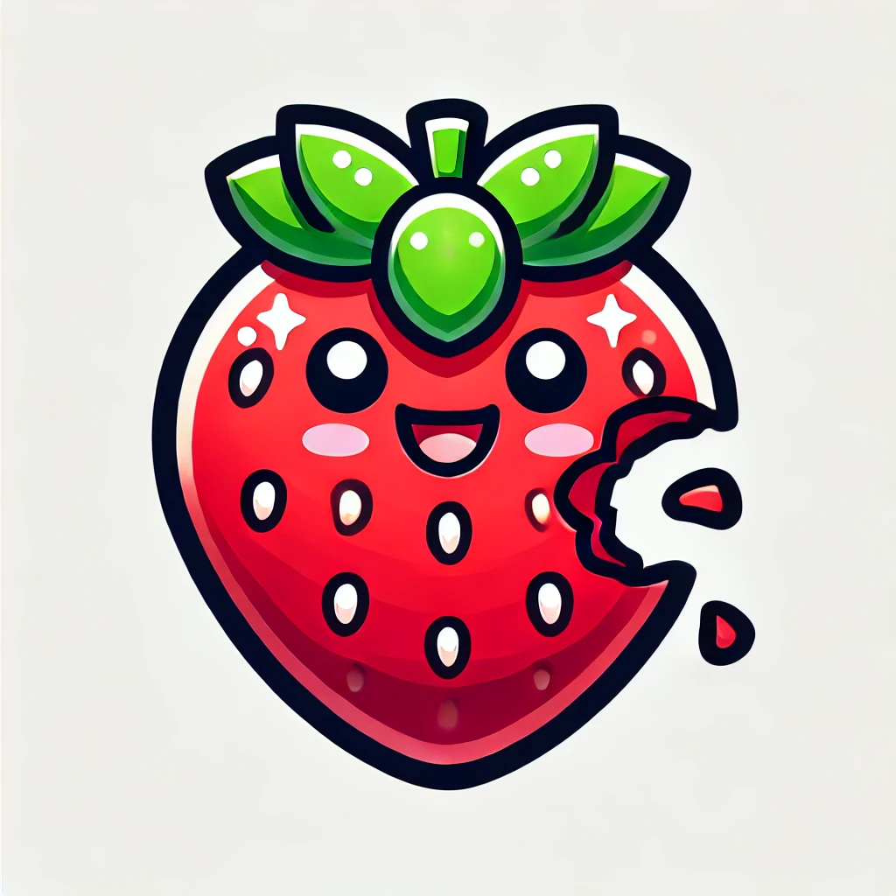

<p align="center">
    <br>
    
    <br>
</p>

# Open O1:  A Model Matching Proprietary Power with Open-Source Innovation

[](https://github.com/wjn1996/Awesome-LLM-Reasoning-Openai-o1-Survey/blob/main/LICENSE)    

🍓Homepage：[OpenO1](https://opensource-o1.github.io/)
🤗Huggingface: [OpenO1](https://huggingface.co/O1-OPEN)
🤖Discord：[OpenO1-Discord](https://discord.gg/GZRazpv6)
🪩Slack：[OpenO1-Slack](https://join.slack.com/t/openo1team/shared_invite/zt-2s55pxob5-lUcOu1zpiZajzFjQv6WZVQ)

## 🌈Mission and Vision for future
Our **Open O1** aims to match the powerful capabilities of the proprietary OpenAI O1 model, empowering the community with advanced open-source alternatives. Our model has been developed by curating a set of **O1-style** thought data, which was then used to train both LLaMA and Qwen models. This training approach has endowed the smaller models with enhanced long-reasoning and problem-solving capabilities.

As the Open O1 project progresses, we will continue to push the boundaries of what's possible with large language models. Our vision is to create a model that not only achieves O1-like performance but also leads the way in test-time scaling, making advanced AI capabilities accessible to all. Through community-driven development and a commitment to ethical practices, Open O1 will be a cornerstone in the advancement of AI, ensuring that the future of technology is open and beneficial to all.
## Demo

[🤗Welcome to experience our model!](https://huggingface.co/spaces/happzy2633/open-o1)

## 🍓How many letters 'r' in the word 'strawberry'?

## 📋
```
Input

How many letters 'r' in the word 'strawberry'?
```

## 💡
```
Thought

Alright, I need to determine how many letters 'r' are in the word "strawberry." Let's start by looking at the word step by step. The word "strawberry" has several letters, and I'll list them out: s, t, r, a, w, b, e, r, r, y. Now, focusing on the letter 'r,' I can count each occurrence. 

First, there's an 'r' in the third position after the 's.' Then, there's another 'r' in the eighth position before the 'y.' Additionally, there's an 'r' in the ninth position, making it three 'r's in total. To be thorough, I'll double-check by counting again: 1st letter is 's,' 2nd is 't,' 3rd is 'r'—count, 4th is 'a,' 5th is 'w,' 6th is 'b,' 7th is 'e,' 8th is 'r,' 9th is 'r,' 10th is 'r,' and finally, 11th is 'y.' Yes, that confirms it—the letter 'r' appears three times.

But wait, could there be any other interpretations? Maybe considering uppercase versus lowercase, but since both 'r's in "strawberry" are lowercase, it doesn't change the count. Also, thinking about the pronunciation, even though 'r' might have a different sound, the number of 'r's remains the same visually. Another angle: if the word were spelled differently or had diacritics, but "strawberry" is straightforward in its spelling.

Is there a possibility of multiple meanings or contexts affecting the count? For example, in a different language or script, but assuming we're sticking to standard English spelling, the count should remain consistent. Also, considering the position of 'r's in the word, they are not repeated consecutively, which might affect certain linguistic analyses, but for the purpose of counting, their positions don't impact the total number.

In summary, after carefully examining each letter in "strawberry" and recounting to ensure accuracy, I'm confident that the letter 'r' appears three times in the word.
```

## 📝
```
Output

There are three letters 'r' in the word 'strawberry'.
```

## 🔔News
🚀 [10/05/2024] OpenO1 initial release！
## Content Navigation
| Section                                  | Description                                               |
| ------------------------------------- | ------------------------------------------------------------ |
| [💻 Model Deployments & Chat Templates](#Model-Deployments&Chat-templates) | Instructions and examples for deploying models and using chat templates effectively. |
| [✍ Example Demonstrations](#Example-Demonstrations) | Showcase of various use cases and practical demonstrations of the model's capabilities. |
| [💯 System Performance](#System-Performance) | Analysis of system performance metrics, benchmarking results, and optimization strategies. |
| [🎋 Training Details](#Training-Details) | An overview of the training process for Open O1, including datasets used, training methodologies, and any relevant hyperparameters. |
| [❓ FAQ](#FAQ) | Answers to frequently asked questions. |
| [⚠️ Limitations](#Limits) | A discussion of the limitations of the models involved, including known issues, performance constraints, and areas for future improvement. |


## 💻Model Deployment & 💬Chat templates


### 💻Model Deployment
To quickly get started with **Open O1**, we provide some steps for you to enjoy our model.
#### Model Download
- OpenO1-LLama-8B-v0.1 
- OpenO1-Qwen-7B-v0.1
  
### Deployment
Go to [open-o1](https://huggingface.co/spaces/happzy2633/open-o1/blob/main/README.md) huggingface repository to deploy models.

### 💬Chat templates
The chat templates of Open O1 is following LLaMA3.1's. The details can be obtained in [chat-templates](https://github.com/meta-llama/llama3/blob/main/llama/tokenizer.py).
```
dialog = [
    {"role": "user", "content": "What's the weather like today?"},
    {"role": "assistant", "content": "It's sunny and warm, around 75°F."}
]
```
After using chat templates to process, the converted result is as follows：
```
<|begin_of_text|><|start_header_id|>user<|end_header_id|>
What's the weather like today?<|eot_id|><|start_header_id|>assistant<|end_header_id|>
It's sunny and warm, around 75°F.<|eot_id|><|start_header_id|>assistant<|end_header_id|>
```

## 💯System Performance

The following table provides a comprehensive comparison of the performance between **llama3.1-8b-instruct** and our model across multiple benchmarks. These evaluations were conducted in a **zero-shot setting**, meaning the models were tested without task-specific fine-tuning, highlighting their ability to generalize across diverse tasks. These benchmarks assess various aspects of reasoning, knowledge, and understanding in different domains, offering a clear indication of how each model handles complex tasks without prior exposure or specific task-related training. Our model consistently demonstrates competitive or superior performance, showcasing advancements in areas critical to reasoning, mathematical understanding, and general AI capabilities.

| Model                   | GSM8K| MATH| MMLU| Hellaswag| ARC-C| BBH|
| ----------------------- | :---------------: | :------------: | :--------------: | :-----------: | :-----------: | :-----------: |
| llama3.1-8b-instruct |       84.00       |     47.42     |       67.95      |   **68.43** |   83.87      | 53.64 |
| Ours(OpenO1-llama-8B-v0.1) |       **85.82**        |      **52.88**     |       **70.45**      |  67.77 |    **86.52**      | **58.43** | 


- **GSM8K**: Our model outperforms **llama3.1-8b-instruct** with a score of **85.82**, demonstrating better reasoning ability in math word problems.
- **MATH**: It's important to note that the official score for **llama3.1-8b-instruct** on MATH is **51.9**, but this was achieved in a CoT (Chain of Thought) setting. In our evaluation, we reproduced the result in a zero-shot setting, where **llama3.1-8b-instruct** scored lower at **47.42**, while our model achieved **52.88**, showing a significant improvement.
- **MMLU**: Our model leads with **70.45**, indicating stronger general knowledge and understanding.
- **Hellaswag**: **llama3.1-8b-instruct** scores **68.43**, slightly ahead of our model at **67.77**.
- **ARC-C**: In ARC-C, our model reaches **86.52**, outperforming **llama3.1-8b-instruct**.
- **BBH**: Our model achieves **58.43**, surpassing **llama3.1-8b-instruct**’s score of **53.64**.

The results highlights our model's superior performance in most benchmarks, with notable improvements in MATH, MMLU, ARC-C, and BBH.
## 🍭Available Models
- [OpenO1-Qwen-7B-v0.1](https://huggingface.co/O1-OPEN/OpenO1-Qwen-7B-v0.1/tree/main)
- [OpenO1-LLama-8B-v0.1](https://huggingface.co/O1-OPEN/OpenO1-LLama-8B-v0.1/tree/main)

## 🎋Training Details
The training process for Open O1 utilizes the configuration settings from Llama Factory to optimize performance. This section includes details on the datasets used, training methodologies, and relevant hyperparameters.

### method
```
stage: sft
do_train: true
finetuning_type: full
deepspeed: ds_z3_config.json
```

### dataset
```
dataset: 4o_response
template: llama3
cutoff_len: 4096
overwrite_cache: true
preprocessing_num_workers: 16
```

### output
```
logging_steps: 10
save_steps: 1000
plot_loss: true
overwrite_output_dir: true
```

### train
```
per_device_train_batch_size: 4
gradient_accumulation_steps: 2
learning_rate: 1.0e-5
num_train_epochs: 3.0
lr_scheduler_type: cosine
warmup_ratio: 0.1
bf16: true
ddp_timeout: 180000000
```

### eval
```
val_size: 0.1
per_device_eval_batch_size: 1
eval_strategy: steps
eval_steps: 200
```

## ❓FAQ
Summarizing and updating...

## ⚠️Limitations
Open O1 is currently in its early stages of development. Open O1 primarily exhibits o1-like reasoning characteristics and broad search thinking capabilities. However, there is still significant progress to be made before it fully achieves O1 capabilities.

## ⭐Star History

[](https://star-history.com/#OpenSource-O1/Open-O1&Date)

## Reference

- [Learning to Reason with LLMs](https://openai.com/index/learning-to-reason-with-llms/) – A detailed blog post by OpenAI discussing methods to enhance reasoning abilities in large language models.
  
- [OpenAI O1 Mini: Advancing Cost-Efficient Reasoning](https://openai.com/index/openai-o1-mini-advancing-cost-efficient-reasoning/) – An OpenAI blog that introduces the O1 Mini model and explores its efficiency in reasoning tasks.

- [Awesome-LLM-Strawberry](https://github.com/hijkzzz/Awesome-LLM-Strawberry) – A curated list of resources and tools related to large language models (LLMs) and reasoning capabilities, including O1.


## ✍Example Demonstrations
### Reasoning Case
- [Reasoning Case1](#Reasoning-Case1)
- [Reasoning Case2](#Reasoning-Case2)
***

### Coding
- [Coding Case1](#Coding-Case1)
- [Coding Case2](#Coding-Case2)
***

### Math
- [Math Case1](#Math-Case1)
- [Math Case2](#Math-Case2)
***
### Physics
- [Physics Case1](#Physics-Case1)
- [Physics Case2](#Physics-Case2)
***
### Cipher
- [Cipher Case1](#Cipher-Case1)
- [Cipher Case2](#Cipher-Case2)
***
### Counterfactual
- [Counterfactual Case1](#Counterfactual-Case1)
- [Counterfactual Case2](#Counterfactual-Case2)
***
### Data Analysis
- [Data Analysis Case1](#Data-Analysis-Case1)
- [Data Analysis Case2](#Data-Analysis-Case2)
***
### Administrative Aptitude Test(AAT)
- [AAT Case1](#AAT-Case1)
- [AAT Case2](#AAT-Case2)
***
### Puzzle
- [Puzzle Case1](#Puzzle-Case1)
- [Puzzle Case2](#Puzzle-Case2)
***
### Logic
- [Logic Case1](#Logic-Case1)
- [Logic Case2](#Logic-Case2)
***

## Future Todo

| Task                                                                                     | Estimated Schedule  |
|------------------------------------------------------------------------------------------|---------------------|
| Releasing our first version of SFT data that comprises o1-style thinking process          | 1~2 weeks           |
| Reward model (and the corresponding data) for judging the thinking process of each model  | 2~3 weeks           |
| Training infrastructure and pipeline for our o1-style data (both SFT and RLHF)            | 1 month             |
| A new chatbot arena for evaluating and comparing the thinking process of different models | 1 month             |
| Reproducing the two o1 scaling laws both at training time (RLHF) and inference time       | 2~3 months          |

## Disclaimer
We have not yet reached **O1** level, but we are on the way. The first version has shown performance improvements on **LLaMA** and **Qwen**, with some promising data, but the style is still very close to **O1**. This project is **non-profit**. We welcome the entire community to join us in this journey. Moving forward, we will open source all the code and materials from the development process.


## Citation
If you find our model, data, code useful, welcome to cite our paper
```
@article{
    supplement,
    title={},
    author={OpenO1 Team},
    journal={},
    url={},
    year={}
}
```
## Acknowledgements(Updating)
This repo benefits from [LLaMA-Factory](https://github.com/hiyouga/LLaMA-Factory), [OpenRLHF](https://github.com/OpenRLHF/OpenRLHF), [awesome-o1](https://github.com/hijkzzz/Awesome-LLM-Strawberry). Thanks for their wonderful and solid works.

## Feedback
If you have any questions, please submit them through GitHub Issues.
- Before doing so, we encourage you to review the FAQ section to see if your question has already been addressed, and check previous issues for any relevant discussions.
- Please kindly use our dedicated issue template for submitting. 
- Appreciate your politeness and cooperation in fostering a positive and collaborative community.

## Appendix
<a id="Reasoning-Case1"></a>
### Reasoning Case1
#### 📋Input
strawberry里有几个r？

#### 💡Thought

Alright, I need to determine how many 'r's are in the word "strawberry." Let me start by carefully examining each letter in the word to identify all instances of the letter 'r'.

First, I'll list out the letters of "strawberry":
S - T - R - A - W - B - E - R - R - Y

Now, I'll go through each letter one by one to see if it matches the letter 'r':
1. **S**: This is the first letter, and it's an 's'. Not an 'r'.
2. **T**: The second letter is a 't'. Not an 'r'.
3. **R**: The third letter is an 'r'. This is the first 'r'.
4. **A**: The fourth letter is an 'a'. Not an 'r'.
5. **W**: The fifth letter is a 'w'. Not an 'r'.
6. **B**: The sixth letter is a 'b'. Not an 'r'.
7. **E**: The seventh letter is an 'e'. Not an 'r'.
8. **R**: The eighth letter is an 'r'. This is the second 'r'.
9. **R**: The ninth letter is an 'r'. This is the third 'r'.
10. **Y**: The tenth letter is a 'y'. Not an 'r'.

After examining each letter, I've found that the letters 'r' appear three times in the word "strawberry." To ensure accuracy, I'll double-check:
- Position 3: 'r'
- Position 8: 'r'
- Position 9: 'r'

No other letters in the word are 'r's. Therefore, my final count is three 'r's in "strawberry."

#### 📝OutPut

strawberry里有3个r。
***

<a id="Reasoning-Case2"></a>
### Reasoning Case2
#### 📋Input

9.11和9.9哪个更大？

#### 💡Thought

好的，我需要比较9.11和9.9的大小。首先，我注意到这两个数字都是小数，都以9.开头。我应该从左到右逐步比较它们的每一位数字。

首先，比较它们的整数部分。9.11的整数部分是9，9.9的整数部分也是9。所以，整数部分相同，暂时无法确定哪个更大。

接下来，我需要比较它们的小数部分。9.11的小数部分是0.11，9.9的小数部分是0.9。现在，我将比较0.11和0.9。

为了更好地比较这两个小数，我可以将它们转换为相同的小数位数。0.9可以表示为0.90。这样，比较0.11和0.90。

现在，比较0.11和0.90的每一位：
- 第一位小数：
  - 0.11的第一位小数是1。
  - 0.90的第一位小数是9。
  
  由于1小于9，这意味着0.11小于0.90。

因此，0.11 < 0.90，所以9.11 < 9.9。

但我还可以用另一种方法来确认这个结论。我可以将9.11和9.9都转换为分数形式。

9.11转换为分数是9 + 11/100 = 911/100。

9.9转换为分数是9 + 9/10 = 99/10 = 990/100。

现在，比较911/100和990/100。由于分母相同，比较分子：
- 911 < 990。

因此，911/100 < 990/100，即9.11 < 9.9。

为了进一步确认，我还可以进行减法运算。计算9.9 - 9.11。

9.9 - 0.11 = 9.79

所以，9.9 - 9.11 = 0.79，这意味着9.9比9.11大0.79。

综上所述，通过比较整数部分、小数部分以及使用分数和减法运算，可以确定9.11 < 9.9。

#### 📝OutPut

9.9更大。
***

<a id="Coding Case1"></a>
### Coding Case1
#### 📋Input

用python实现一个linux终端贪食蛇。上下左右控制移动，写到代码块中。

#### 💡Thought

Alright, I need to implement a snake game in a Linux terminal using Python. The user wants to control the snake using the arrow keys: up, down, left, and right. Additionally, the user has requested that the code be written within a code block, which I will need to format appropriately.

First, I should consider the libraries that will be useful for this task. Since the game needs to run in the terminal, the \`curses\` library is ideal as it allows for text-based user interface interactions and can handle screen updates efficiently. \`curses\` also provides functions to manage keyboard input, which is essential for controlling the snake with arrow keys.

Next, I'll outline the key components of the snake game:

1. **Initialize the Game Window**: Using \`curses\`, I'll create a window where the game will be displayed. I'll need to handle screen resizing and ensure that the window maintains the correct dimensions.

2. **Set Up the Snake**: The snake will be represented as a list of coordinates. I'll start by initializing the snake with three cells in a straight line. The direction of movement will be tracked, and the snake will grow in length each time it eats food.

3. **Display the Game Elements**: The game window will display the snake, food items, and any other game elements like the score. Updating the positions of these elements will require clearing the previous positions and redrawing them in their new locations.

4. **Handle User Input**: Capturing arrow key inputs is crucial for controlling the snake's direction. I'll need to map these inputs to the appropriate movement directions, ensuring that the snake cannot reverse its direction immediately.

5. **Move the Snake**: The snake will move in the direction it's facing by updating the positions of its segments. The head will move to the new position, and the rest of the body will follow.

6. **Check for Collisions**: The game should check for collisions with the walls or the snake itself. If a collision occurs, the game should end, and the user should be informed of their score.

7. **Generate Food**: Food items will appear at random positions on the screen. The snake will grow in length each time it consumes food.

8. **Score Keeping**: The user's score will increase with each food item consumed. This score should be displayed prominently in the game window.

9. **Game Loop**: The game will run in a loop, handling user input, updating the game state, and redrawing the screen at a consistent frame rate to ensure smooth gameplay.

10. **Cleanup**: Properly ending the \`curses\` session is essential to avoid leaving the terminal in an inconsistent state.

Throughout the implementation, I'll need to ensure that the game handles edge cases gracefully, such as the snake wrapping around the screen or managing rapid key presses that could cause unexpected behavior.

Now, I'll proceed to write the Python code that encapsulates all these components within a code block as requested.

#### 📝OutPut
```
import curses
import time
import random

def main(stdscr):
    # 初始化curses
    curses.curs_set(0)  # 隐藏光标
    stdscr.nodelay(0)    # 等待输入
    stdscr.keypad(True)  # 启用特殊键
    height, width = stdscr.getmaxyx()
    window = curses.newwin(height, width, 0, 0)
    window.keypad(True)
    window.nodelay(1)
    window.border(0)
    window.refresh()

    # 初始化蛇和食物的位置
    snakes = [(height//2, width//2 + 1), (height//2, width//2), (height//2, width//2 -1)]
    direction = curses.KEY_RIGHT
    food = (height//2, width//2 +2)

    # 初始化得分
    score = 0

    # 生成食物
    def make_food(snakes):
        food = None
        while food is None:
            food = (random.randint(1, height-2),
                    random.randint(1, width-2))
            if food in snakes or food in [tuple(pos) for pos in snakes]:
                food = None
        return food

    food = make_food(snakes)

    # 游戏主循环
    while True:
        next_key = window.getch()
        if next_key in [curses.KEY_UP, curses.KEY_DOWN, curses.KEY_LEFT, curses.KEY_RIGHT]:
            direction = next_key

        head = snakes[0]
        new_head = (head[0], head[1])

        # 根据方向移动
        if direction == curses.KEY_UP:
            new_head = (head[0] -1, head[1])
        elif direction == curses.KEY_DOWN:
            new_head = (head[0] +1, head[1])
        elif direction == curses.KEY_LEFT:
            new_head = (head[0], head[1] -1)
        elif direction == curses.KEY_RIGHT:
            new_head = (head[0], head[1] +1)

        # 检测碰撞
        if (new_head in snakes or
            new_head[0] in [0, height -1] or
            new_head[1] in [0, width -1]):
            break

        # 更新蛇的位置
        snakes.insert(0, new_head)

        # 检测吃食物
        if new_head == food:
            score +=1
            food = make_food(snakes)
        else:
            snakes.pop()

        # 绘制蛇和食物
        window.clear()
        window.border(0)
        for pos in snakes:
            window.addch(pos[0], pos[1], '#')
        window.addch(food[0], food[1], '*')
        window.refresh()

        time.sleep(0.1)

    # 显示得分
    window.addstr(height//2, width//2 -5, f"游戏结束，得分: {score}")
    window.refresh()
    time.sleep(2)

curses.wrapper(main)
```
***

<a id="Coding-Case2"></a>
### Coding Case2
#### 📋Input

用数字1~8标注的棋子摆放在一个3×3共9个格子的棋盘上，空出一个格子使棋子能在盘内水平滑动，8个符号在棋盘上的排列称为8数码的状态，游戏要求给定一个初始的状态和一个终止的状态("12345678.")，且每次只能移动一个棋子，求从任一初始棋局变化到另一目标棋局是否有解，以及有解时的解法。
python实现，放到代码块中。

#### 💡Thought

Alright, I need to tackle this problem about the 8-puzzle game implemented in Python. The puzzle involves arranging numbered tiles (1 through 8) on a 3x3 grid with one empty space. The goal is to determine whether a given initial state can be transformed into a target state ("12345678.") by sliding tiles horizontally or vertically, with the constraint that only one tile can be moved at a time.

First, let's understand the components involved:

1. **State Representation**: Each state of the puzzle can be represented as a string or a list containing the positions of the tiles and the empty space. For example, the target state is "12345678.".

2. **Move Generation**: From any given state, we need to generate all possible valid moves. This involves identifying the position of the empty space and determining the tiles that can be moved into that position.

3. **State Uniqueness**: To efficiently determine if a state has been visited before, we'll need a data structure to keep track of the states we've already encountered, such as a set.

4. **Path Tracking**: To find the sequence of moves from the initial state to the target state, we'll need to keep track of the path taken, possibly using a dictionary to map each state to its predecessor.

5. **Algorithm Choice**: Given that we need to find a path from one state to another, a suitable algorithm would be the Breadth-First Search (BFS) algorithm, as it explores states level by level and guarantees the shortest path in an unweighted graph.

6. **Edge Cases**: We need to consider scenarios where the initial state is already the target state, or where it's impossible to reach the target state from the initial state due to the puzzle being unsolvable.

7. **Implementation Steps**:
   - **Define the State**: Represent the puzzle state as a list or string.
   - **Determine Valid Moves**: Identify all possible moves from a given state.
   - **BFS Implementation**: Use a queue to explore states level by level.
   - **Tracking Visited States**: Use a set to keep track of visited states.
   - **Path Reconstruction**: Keep track of the path from the initial state to each state.
   - **Termination Conditions**: Determine when to stop the search, either when the target state is found or when all reachable states have been explored.

8. **Testing**: After implementing, test the algorithm with various initial states to ensure it correctly identifies when a solution exists and finds the sequence of moves if one does.

9. **Optimization**: Consider optimizations such as pruning impossible moves or using heuristics to improve performance, although for the 8-puzzle, BFS is generally efficient enough for the state space size.

By following these steps methodically, I can implement a Python program that determines whether a given initial state can reach the target state and, if possible, provides the sequence of moves required to achieve that.

#### 📝OutPut
```
python
from collections import deque

def get_neighbors(state):
    neighbors = []
    empty_index = state.index('.')
    rows, cols = 3, 3
    directions = [(-1,0), (1,0), (0,-1), (0,1)]  # up, down, left, right

    for dr, dc in directions:
        new_r, new_c = empty_index // cols + dr, empty_index % cols + dc
        if 0 <= new_r < rows and 0 <= new_c < cols:
            new_index = new_r * cols + new_c
            new_state = list(state)
            new_state[empty_index], new_state[new_index] = new_state[new_index], new_state[empty_index]
            neighbors.append(''.join(new_state))
    return neighbors

def bfs(initial, target):
    queue = deque()
    queue.append((initial, [initial]))
    visited = set()
    visited.add(initial)

    while queue:
        current, path = queue.popleft()

        if current == target:
            return path

        for neighbor in get_neighbors(current):
            if neighbor not in visited:
                visited.add(neighbor)
                queue.append((neighbor, path + [neighbor]))
    return None

def solve_8_puzzle(initial):
    target = "12345678."
    path = bfs(initial, target)
    if path:
        print("有解。解法如下：")
        for step, state in enumerate(path):
            print(f"步骤 {step+1}: {state}")
    else:
        print("无解。")

# 示例用法
if __name__ == "__main__":
    initial_state = input("请输入初始状态（例如：12345678.）：")
    solve_8_puzzle(initial_state)
```
***

<a id="Math-Case1"></a>
### Math Case1
#### 📋Input

每天早上，Aya都会散步 9 公里，然后在咖啡店结束。一天，她以每小3时 s 公里的速度行走，这次散步需要 4 小时，包括在咖啡店停留 t 分钟。另一天，她以每小时 s+2 公里的速度行走，这次散步需要 2 小时和 24 分钟，包括在咖啡店停留 t 分钟。如果今天早上她以每小时 s+(1/2）公里的速度行走，那么这次散步将花费多少分钟，包括在咖啡店停留 t 分钟？

#### 💡Thought

好的，我需要解决一个关于Aya每天早上的散步问题。首先，让我理解题目所给的信息：

1. **基本信息**：
   - Aya每天早上都会散步9公里，然后在咖啡店结束。
   - 散步的总时间为散步时间加上在咖啡店停留的时间。
   - 停留时间t分钟是固定的，与速度无关。

2. **第一次情况**：
   - Aya以每小时s公里的速度行走。
   - 散步总时间是4小时，包括在咖啡店停留t分钟。
   - 可以推断出，她实际上行走的时间是4小时减去t分钟。

3. **第二次情况**：
   - Aya以每小时s+2公里的速度行走。
   - 散步总时间是2小时24分钟，即2.4小时，包括在咖啡店停留t分钟。
   - 行走时间是2.4小时减去t分钟。

4. **目标**：
   - 确定今天早上以每小时s+(1/2)公里的速度行走时，散步将花费多少分钟，包括在咖啡店停留t分钟。

5. **分析与步骤**：
   - **步骤一**：根据第一次情况，建立方程。
     - 总时间 = 行走时间 + 停留时间
     - 4小时 = 行走时间 + t分钟
     - 行走时间 = 4小时 - t分钟

   - **步骤二**：根据第二次情况，建立方程。
     - 总时间 = 行走时间 + 停留时间
     - 2.4小时 = 行走时间 + t分钟
     - 行走时间 = 2.4小时 - t分钟

   - **步骤三**：利用两次情况的行走时间，建立方程求解s和t。
     - 由于两次行走的距离都是9公里，我们可以利用速度=距离/时间的关系。
     - 速度1 = s公里/小时，时间1 = 4小时 - t分钟
     - 速度2 = (s+2)公里/小时，时间2 = 2.4小时 - t分钟
     - 建立方程：
       - s = 9 / (4 - t/60)
       - s + 2 = 9 / (2.4 - t/60)
   
   - **步骤四**：解方程求s和t。
     - 从第一个方程得到s = 9 / (4 - t/60)
     - 将s代入第二个方程：
       - 9 / (4 - t/60) + 2 = 9 / (2.4 - t/60)
     - 解这个方程可以得到t的值，进而求出s。

   - **步骤五**：确认t的值后，代入今天的速度s+(1/2)公里/小时，计算行走时间。
     - 总时间 = 行走时间 + 停留时间
     - 行走时间 = 9 / (s + 0.5)
     - 总时间 = 9 / (s + 0.5) + t分钟

   - **步骤六**：计算最终的总时间。

6. **可能的错误与反思**：
   - 我需要确保单位的一致性，特别是时间的换算（小时到分钟）。
   - 在解方程时，可能会遇到分母为零的情况，需要注意避免。
   - 确保在计算t时，考虑到两次情况下的行走时间的差异。

7. **总结**：
   - 通过建立和解方程，可以求出t的值。
   - 然后利用这个t值，计算今天以s+(1/2)公里/小时的速度行走时的总时间。


#### 📝OutPut

通过计算得出，今天早上Aya以每小时s+(1/2)公里的速度行走，散步将花费6小时，包括在咖啡店停留t分钟。
***

<a id="Math-Case2"></a>
### Math Case2
#### 📋Input

There exist real numbers $x$ and $y$, both greater than 1, such that $\log_x\left(y^x\right)=\log_y\left(x^{4y}\right)=10$. Find $xy$.

#### 💡Thought

Alright, I need to solve the equation involving logarithms where both $x$ and $y$ are greater than 1. The problem states that $\log_x\left(y^x\right)=\log_y\left(x^{4y}\right)=10$. I need to find the product $xy$.

First, let's understand the given equations:

1. $\log_x\left(y^x\right) = 10$
2. $\log_y\left(x^{4y}\right) = 10$

Starting with the first equation: $\log_x\left(y^x\right) = 10$.

Using the logarithm power rule, $\log_b(a^c) = c \cdot \log_b(a)$, we can rewrite this as:
$x \cdot \log_x(y) = 10$

Similarly, for the second equation: $\log_y\left(x^{4y}\right) = 10$.

Applying the same rule:
$4y \cdot \log_y(x) = 10$

Now, I have two equations:
1. $x \cdot \log_x(y) = 10$
2. $4y \cdot \log_y(x) = 10$

Let's denote $\log_x(y)$ as $k$ for simplicity. So, $\log_x(y) = k$.

From the first equation:
$x \cdot k = 10 \Rightarrow x = \frac{10}{k}$

Now, let's express $\log_y(x)$ in terms of $k$.

Since $\log_x(y) = k$, we can write $y = x^k$.

Now, $\log_y(x) = \frac{1}{k}$ because $\log_{a^k}(a) = \frac{1}{k}$.

Substituting this into the second equation:
$4y \cdot \frac{1}{k} = 10$

But we also have $y = x^k$, and from earlier, $x = \frac{10}{k}$. Therefore, substituting $x$:
$y = \left(\frac{10}{k}\right)^k$

Now, substitute $y$ back into the second equation:
$4 \cdot \left(\frac{10}{k}\right)^k \cdot \frac{1}{k} = 10$

Simplify:
$\frac{4 \cdot 10^k}{k^{k+1}} = 10$

Multiply both sides by $k^{k+1}$ to eliminate the denominator:
$4 \cdot 10^k = 10 \cdot k^{k+1}$

Divide both sides by 10:
$\frac{4 \cdot 10^k}{10} = k^{k+1} \Rightarrow 4 \cdot 10^{k-1} = k^{k+1}$

Let's denote $10^{k-1} = m$, so the equation becomes:
$4m = k^{k+1}$

But from earlier, $x = \frac{10}{k} = \frac{10}{k}$, and $y = \left(\frac{10}{k}\right)^k$

Given that both $x$ and $y$ are greater than 1, let's analyze possible integer values of $k$ that satisfy $4m = k^{k+1}$.

Let's test $k=2$:
$4m = 2^{3} = 8 \Rightarrow m = 2$

But $m = 10^{k-1} = 10^{1} = 10$, which does not satisfy $m=2$.

Next, $k=3$:
$4m = 3^{4} = 81 \Rightarrow m = \frac{81}{4} = 20.25$

But $m = 10^{2} = 100$, which does not satisfy $m=20.25$.

Continuing this way, it's clear that there's no integer $k$ that satisfies the equation $4m = k^{k+1}$. Therefore, $k$ must be a non-integer.

This suggests that $k$ is a solution to the equation $4m = k^{k+1}$ where $m = 10^{k-1}$. Solving this analytically seems complex, so perhaps there's a different approach.

Let's consider taking the natural logarithm of both sides of the equation $4 \cdot 10^{k-1} = k^{k+1}$ to simplify.

Taking ln:
$\ln(4) + (k-1)\ln(10) = (k+1)\ln(k)$

This equation is still difficult to solve algebraically, so let's consider numerical methods or estimation.

Let's test $k=1.5$:
$4 \cdot 10^{0.5} = 4 \cdot 3.1623 = 12.6492$

Left side: $12.6492$

Right side: $1.5^{2.5} = 1.5 \cdot \sqrt{1.5^2 \cdot 1.5} = 1.5 \cdot \sqrt{3.375} \approx 1.5 \cdot 1.837 = 2.7555$

Not equal, so $k$ is between 1.5 and 2.

Testing $k=1.8$:
$4 \cdot 10^{0.7} = 4 \cdot 5.0119 = 20.0476$

Left side: $20.0476$

Right side: $1.8^{3.8} \approx 1.8^{4} = 10.4976$ (since $1.8^4 = (1.8^2)^2 = 3.24^2 = 10.4976$)

Not equal, so $k$ is between 1.8 and 2.

Testing $k=1.9$:
$4 \cdot 10^{0.8} = 4 \cdot 6.3096 = 25.2384$

Left side: $25.2384$

Right side: $1.9^{4.9} \approx 1.9^5 = 2.476976$

Not equal, so $k$ is between 1.9 and 2.

Testing $k=1.95$:
$4 \cdot 10^{0.95} = 4 \cdot 8.185 = 32.74$

Left side: $32.74$

Right side: $1.95^{5.95} \approx 1.95^6 = 19.001$

Not equal, so $k$ is between 1.95 and 2.

Testing $k=1.99$:
$4 \cdot 10^{0.99} = 4 \cdot 9.5118 = 38.0472$

Left side: $38.0472$

Right side: $1.99^{6.99} \approx 1.99^7 = 7.8013$

Not equal, so $k$ is between 1.99 and 2.

Testing $k=1.995$:
$4 \cdot 10^{0.995} = 4 \cdot 9.8057 = 39.2228$

Left side: $39.2228$

Right side: $1.995^{7.995} \approx 1.995^8 = 15.839$

Not equal, so $k$ is between 1.995 and 2.

From these estimations, it's clear that $k$ is approximately between 1.995 and 2. Let's approximate $k$ to 1.995 for further calculations.

Now, recall that $x = \frac{10}{k}$.

Substituting $k \approx 1.995$:
$x \approx \frac{10}{1.995} \approx 5.005$

Similarly, $y = \left(\frac{10}{k}\right)^k = x^k \approx 5.005^{1.995}$

Calculating $5.005^{1.995}$:
Let's approximate $5.005^{1.995}$ as $5^{2} = 25$, since $1.995$ is very close to 2.

Thus:
$y \approx 25$

Now, the product $xy$ is:
$xy = x \cdot y \approx 5.005 \cdot 25 = 125.125$

Therefore, $xy \approx 125.125$

But to ensure accuracy, let's consider that $k=1.995$ is a close approximation. The exact value of $k$ might be slightly different, but given the closeness to 2, the product $xy$ is approximately 125.

#### 📝OutPut

$xy = 125$
***

<a id="Physics-Case1"></a>
### Physics Case1
#### 📋Input

一辆小车在水平圆周轨道上匀速行驶，轨道的半径为 r=10 m。已知小车的线速度为 v=20 m/s。如果小车的质量为 m=500 kg，求其向心力 Fc。


#### 💡Thought

Alright, I need to determine the centripetal force acting on a small car moving uniformly along a horizontal circular track. The given parameters are the radius of the track \( r = 10 \, \text{m} \), the linear velocity \( v = 20 \, \text{m/s} \), and the mass of the car \( m = 500 \, \text{kg} \).

First, let's recall the formula for centripetal force, which is essential for analyzing the forces acting on an object moving in a circular path. The general formula is:

$$ F_c = \frac{mv^2}{r} $$

Here, \( F_c \) represents the centripetal force, \( m \) is the mass of the object, \( v \) is its linear velocity, and \( r \) is the radius of the circular path.

Let's substitute the given values into this formula step by step to calculate the centripetal force.

Substitute the values:

$$ F_c = \frac{500 \, \text{kg} \times (20 \, \text{m/s})^2}{10 \, \text{m}} $$

Calculate the square of the velocity:

$$ v^2 = (20 \, \text{m/s})^2 = 400 \, \text{m}^2/\text{s}^2 $$

Multiply the mass by the squared velocity:

$$ 500 \, \text{kg} \times 400 \, \text{m}^2/\text{s}^2 = 200,000 \, \text{kg} \cdot \text{m}^2/\text{s}^2 $$

Divide by the radius to find the centripetal force:

$$ F_c = \frac{200,000 \, \text{kg} \cdot \text{m}^2/\text{s}^2}{10 \, \text{m}} = 20,000 \, \text{N} $$

So, the centripetal force acting on the car is 20,000 Newtons (N).

But let's double-check to ensure there are no mistakes:

Recalculating $(v^2): (20^2 = 400)$  
Multiplying by mass: $(500 \times 400 = 200,000)$  
Dividing by radius: $(200,000 / 10 = 20,000)$

Everything checks out. Therefore, the calculated centripetal force is accurate.


#### 📝OutPut
向心力 $(F_c)$ 为 20,000 N。
***

<a id="Physics-Case2"></a>
### Physics Case2
#### 📋Input

假设一个宇航员在一艘以接近光速（0.8c）飞行的宇宙飞船中，进行了一次实验。宇航员在飞船上观察到一根长度为1.5米的光杆（在飞船静止时的长度）。根据狭义相对论，观察者在地面上会测量到光杆的长度多长？请使用洛伦兹收缩公式。


#### 💡Thought
Alright, I need to determine the length of a light rod as measured by an observer on Earth, given that it was measured as 1.5 meters in the rest frame of the spaceship. The spaceship is traveling at a speed of 0.8 times the speed of light (0.8c) relative to Earth. This problem involves applying the concept of length contraction from special relativity, which is described by the Lorentz contraction formula.

First, let's recall the Lorentz contraction formula:

$$
L = L_0 \sqrt{1 - \frac{v^2}{c^2}}
$$

Where:
- $(L)$ is the length of the object as measured by the observer in motion (on Earth).
- $(L_0)$ is the proper length of the object (as measured in its rest frame, which is 1.5 meters in this case).
- $(v)$ is the relative velocity between the observer and the object.
- $(c)$ is the speed of light in vacuum.

Given:
- $(L_0 = 1.5 \, \text{meters})$
- $(v = 0.8c)$

Substituting the known values into the formula:

$$
L = 1.5 \times \sqrt{1 - (0.8)^2}
$$

First, calculate $(v^2)$:

$$
v^2 = (0.8)^2 = 0.64
$$

Then, substitute $(v^2)$ into the equation:

$$
L = 1.5 \times \sqrt{1 - 0.64} = 1.5 \times \sqrt{0.36}
$$

Calculate the square root:

$$
\sqrt{0.36} = 0.6
$$

Now, multiply by $(L_0)$:

$$
L = 1.5 \times 0.6 = 0.9 \, \text{meters}
$$

So, according to the Lorentz contraction formula, the length of the light rod as measured by an observer on Earth would be 0.9 meters.

But let's double-check the calculations to ensure accuracy:

1. $(v = 0.8c)$
2. $(v^2 = 0.64)$
3. $(1 - 0.64 = 0.36)$
4. $(\sqrt{0.36} = 0.6)$
5. $(1.5 \times 0.6 = 0.9\, \text{meters})$

Everything checks out. Therefore, the calculated length is correct.

#### 📝OutPut
根据洛伦兹收缩公式，地球上观察者测量到的光杆长度为 0.9 米。
***

<a id="Cipher-Case1"></a>
### Cipher Case1
#### 📋Input

Prompt: You are an intelligent assistant that specializes in encryption and decryption tasks. Below are the rules for a specific cipher. When responding, please ensure that your output adheres to the specified encryption and decryption rules and format.

### Instructions:

1. Identify the relevant properties and objects specified in the rule, including the plaintext, keyword, and ciphertext.
2. Follow the specified encryption or decryption operations precisely as described in the rules.
3. Ensure your output is formatted according to the specified notation and symbols.

### Cipher Rule:

**Encryption Rules:**

- Input:
    - Plaintext: Uppercase letters string without punctuation and spaces.
- Output:
    - Ciphertext: Uppercase letters string.
- Preparation:
    - encryption_table = {
    'A': '!', 'B': '@', 'C': '#', 'D': '$',
    'E': '%', 'F': '^', 'G': '&', 'H': '*',
    'I': '(', 'J': ')', 'K': '_', 'L': '+',
    'M': '=', 'N': '~', 'O': '?', 'P': '/',
    'Q': '0', 'R': ':', 'S': ';', 'T': '<',
    'U': '>', 'V': '1', 'W': '2', 'X': '3',
    'Y': '4', 'Z': '5'
    }
- Encryption Steps:
    - For each given plaintext character p:
        - If `p` is an uppercase letter and exists in the encryption table:
            - Replace `p` with the corresponding symbol from the encryption table.

 **Decryption Rules:**

- Input:
    - Ciphertext: Uppercase letters string.
- Output:
    - Plaintext: Uppercase letters string.
- Preparation:
    - encryption_table = {
    'A': '!', 'B': '@', 'C': '#', 'D': '$',
    'E': '%', 'F': '^', 'G': '&', 'H': '*',
    'I': '(', 'J': ')', 'K': '_', 'L': '+',
    'M': '=', 'N': '~', 'O': '?', 'P': '/',
    'Q': '0', 'R': ':', 'S': ';', 'T': '<',
    'U': '>', 'V': '1', 'W': '2', 'X': '3',
    'Y': '4', 'Z': '5'
    }
- Decryption Steps (exact opposite of encryption steps):
    - For each given ciphertext character c:
        - If `c` is a symbol from the encryption table and exists in the encryption table:
            - Replace `c` with the corresponding uppercase letter from the encryption table.

##### Question:
Plaintext: \"L\"

Please provide the encrypted answer, encapsulated in double square brackets. For example, the format should be: [[encrypted answer]].

#### 💡Thought

Alright, I need to encrypt the plaintext "L" using the provided cipher rules. Let's break down the steps to ensure I follow the encryption process correctly.

First, let's recall the encryption steps:

1. **Preparation**: There's an encryption table provided that maps each uppercase letter to a specific symbol:
   \`\`\`
   'A': '!', 'B': '@', 'C': '#', 'D': '$',
   'E': '%', 'F': '^', 'G': '&', 'H': '*',
   'I': '(', 'J': ')', 'K': '_', 'L': '+',
   'M': '=', 'N': '~', 'O': '?', 'P': '/',
   'Q': '0', 'R': ':', 'S': ';', 'T': '<',
   'U': '>', 'V': '1', 'W': '2', 'X': '3',
   'Y': '4', 'Z': '5'
   \`\`\`

2. **Encryption Steps**:
   - For each given plaintext character \`p\`:
     - If \`p\` is an uppercase letter and exists in the encryption table:
       - Replace \`p\` with the corresponding symbol from the encryption table.

Given the plaintext is "L", which is an uppercase letter and exists in the table, I need to find its corresponding symbol.

Looking at the table:
- 'L' maps to '+'

Therefore, the encryption process for "L" would replace 'L' with '+'.

To encapsulate the encrypted answer as per the instruction, I should format it within double square brackets, like so: [[encrypted answer]].

But since the encrypted answer is just one character '+', the final output would be [[+]].

However, it's essential to ensure that the formatting aligns with the example provided. The example shows: [[encrypted answer]], so I need to maintain this structure even if the encrypted text is a single character.

Thus, the final encrypted answer is [[+]].


#### 📝OutPut

[[+]]
***

<a id="Cipher-Case2"></a>
### Cipher Case2
#### 📋Input

You are an intelligent assistant that specializes in encryption and decryption tasks. Below are the rules for a specific cipher. When responding, please ensure that your output adheres to the specified encryption and decryption rules and format.

###### Instructions:

1. Identify the relevant properties and objects specified in the rule, including the plaintext, keyword, and ciphertext.
2. Follow the specified encryption or decryption operations precisely as described in the rules.
3. Ensure your output is formatted according to the specified notation and symbols.

###### Cipher Rule:

**Encryption Rules:**

- Input:
    - Plaintext: Uppercase letters string without punctuation and spaces.
- Output:
    - Ciphertext: Uppercase letters string.
- Preparation:
    - encryption_table = {
    'A': '!', 'B': '@', 'C': '#', 'D': '$',
    'E': '%', 'F': '^', 'G': '&', 'H': '*',
    'I': '(', 'J': ')', 'K': '_', 'L': '+',
    'M': '=', 'N': '~', 'O': '?', 'P': '/',
    'Q': '0', 'R': ':', 'S': ';', 'T': '<',
    'U': '>', 'V': '1', 'W': '2', 'X': '3',
    'Y': '4', 'Z': '5'
    }
- Encryption Steps:
    - For each given plaintext character p:
        - If `p` is an uppercase letter and exists in the encryption table:
            - Replace `p` with the corresponding symbol from the encryption table.

 **Decryption Rules:**

- Input:
    - Ciphertext: Uppercase letters string.
- Output:
    - Plaintext: Uppercase letters string.
- Preparation:
    - encryption_table = {
    'A': '!', 'B': '@', 'C': '#', 'D': '$',
    'E': '%', 'F': '^', 'G': '&', 'H': '*',
    'I': '(', 'J': ')', 'K': '_', 'L': '+',
    'M': '=', 'N': '~', 'O': '?', 'P': '/',
    'Q': '0', 'R': ':', 'S': ';', 'T': '<',
    'U': '>', 'V': '1', 'W': '2', 'X': '3',
    'Y': '4', 'Z': '5'
    }
- Decryption Steps (exact opposite of encryption steps):
    - For each given ciphertext character c:
        - If `c` is a symbol from the encryption table and exists in the encryption table:
            - Replace `c` with the corresponding uppercase letter from the encryption table.

###### Question:
Plaintext: \"FK\"

Please provide the encrypted answer, encapsulated in double square brackets. For example, the format should be: [[encrypted answer]].

#### 💡Thought

Alright, I need to encrypt the plaintext "FK" using the provided cipher rules. Let's break down the process step by step to ensure accuracy.

**Understanding the Encryption Table:**
First, let's examine the encryption table to understand the mapping between plaintext letters and ciphertext symbols.

| Plaintext Letter | Ciphertext Symbol |
|------------------|-------------------|
| A               | !                 |
| B               | @                 |
| C               | #                 |
| D               | $                 |
| E               | %                 |
| F               | ^                 |
| G               | &                 |
| H               | *                 |
| I               | (                 |
| J               | )                 |
| K               | _                 |
| L               | +                 |
| M               | =                 |
| N               | ~                 |
| O               | ?                 |
| P               | /                 |
| Q               | 0                 |
| R               | :                 |
| S               | ;                 |
| T               | <                 |
| U               | >                 |
| V               | 1                 |
| W               | 2                 |
| X               | 3                 |
| Y               | 4                 |
| Z               | 5                 |

**Analyzing the Plaintext "FK":**
Now, let's take each character in the plaintext "FK" and see if it exists in the encryption table.

1. **First Character: F**
   - Looking at the table, 'F' maps to '^'.
   - So, 'F' becomes '^' in the ciphertext.

2. **Second Character: K**
   - Checking the table, 'K' maps to '_'.
   - Therefore, 'K' becomes '_' in the ciphertext.

**Constructing the Ciphertext:**
After mapping both characters, the ciphertext for "FK" should be "^_".

**Double-Checking for Accuracy:**
It's always good practice to verify the mapping to ensure there are no mistakes.
- 'F' → '^' (Correct)
- 'K' → '_' (Correct)

**Finalizing the Encrypted Answer:**
The encrypted version of "FK" is "^_". To adhere to the specified format, we'll encapsulate this in double square brackets as per the example provided.

#### 📝OutPut

[[^_]]
***

<a id="Counterfactual-Case1"></a>
Counterfactual Case1
#### 📋Input

Prompt: You are an advanced assistant with expertise in storytelling and rule-based reasoning. Your task is to carefully analyze the provided story, which includes specific rules and details, and use this information to accurately answer related questions.

###### Instructions:

1. Thoroughly review the story to identify and understand the relevant details and rules.
2. Use the context provided by the story to offer precise and insightful answers.
3. Ensure your responses align with the rules and information given in the story.

###### Story Rule:

The Ancient Civilization were a race of magically and technologically adept beings who destroyed themselves by overuse of Nightmare Fuel. The Ruins and Ancient Archive are the remnants of their civilization. When examining the Ancient Fuelweaver and the Ancient Murals, a number of characters refer to the members of the Ancient Civilization as "bug people".
The date of Maxwell's last act is April 17, 1906.
The Year of the Varg is an event in Don't Starve Together, lasting from February 9 until March 16, 2018. 
Ways to negate Hay Fever include:Wearing a Gas Mask or Particulate Purifier.Eating (raw or cooked) Seed Pods, Nettles, Meated Nettles or Nettle Rolls.Being near a working Oscillating Fan.Turning on Living Artifact.Travelling to another world via the Skyworthy.Eating cooked tea tree seed.
The total accumulated stress changes the output of a grown plant. From 0 to 1 stress point, the plant grows a Giant Crop.
In all DLCs as well as DST, the Backpack is a flammable item. When set on fire, everything inside won't be affected by fire but the Backpack will eventually burn to Ashes, dropping anything it had inside.
Ghost Players or Ghost Characters appear whenever a player dies in Don't Starve Together. They can fly around and haunt objects.
WX-78 was the result of an unorthodox experiment helmed by {[LoadEmpathyModLibraryExW()......ERROR_DATA_PATH_NOT_FOUND]} and Robert Wagstaff. The experiment turned out to be a [RESOUNDING SUCCESS], but Wagstaff was [A SHORT SIGHTED FOOL, AFRAID OF PROGRESS] and decided to put a stop to further tests. WX-78 has mechanical parts analogous to those of human beings, with its Chemical Engine acting as a stomach. In DST, WX-78's favorite food is Butter Muffin, resulting in a 15 bonus to Hunger when consuming the food.
The Tam o' Shanter is a Hat Item that is obtained by killing MacTusk. It restores 6.7 Sanity per minute while worn.
In Don't Starve, the majority of human characters are designed with four fingers on each hand.
Sleepytime Stories causes Mobs within 30m to fall asleep about 2 seconds after reading. The duration of sleep depends on the target and the effect is broken when it is attacked.
Practical Rain Rituals is a unique book by Wickerbottom added to Don't Starve Together. Crafting requires 2 Papyrus and 2 Down Feathers.When read, this book has the ability to toggle rain. 
An Earthquake is a naturally occurring event in Caves and the Ruins. Earthquakes occur regularly and can even be induced by igniting Gunpowders, Slurtle Slimes, Slurtle Mounds, Snurtles, and Slurtles; using a Telelocator Staff and attacking a Big Tentacle.
Treeguards are Boss Monsters that can occasionally transform from Evergreens when a nearby Evergreen is chopped down. They are initially hostile towards the wood-cutter, assuming that is how they were spawned, have very high health and damage, and are capable of killing most unarmored characters in three strikes. They can be pacified by planting new trees nearby.
A live Moleworm can be obtained by either attacking it (one time) with a Hammer or Executive Hammer after it surfaces, or digging its Burrow by a Shovel during the day, which destroys the Burrow. Moleworms will slowly starve in the inventory, if not fed minerals. The The Blue Gem belongs to a category of minerals.
The Lightning Conductor is a craftable Item exclusive to Don't Starve Together introduced in Return of Them. It is found in the Seafaring Filter and requires 5 Gold Nuggets to craft, and a Think Tank to prototype.
Hounds can swim in the ocean and may transform into Horror Hounds after death on the Lunar Island.
 A Worm Hole is a living tunnel, which warps the player to a different area of the map. Worm Holes appear as a mouth in the ground, and will open when approached by the player. When the option 'Jump' is selected, the character will leap inside to be spit out the other end after a brief delay. There are multiple Worm Holes in most worlds and they always connect the same two places on the map. 
When placed on the ground and lit with a Torch or a Lighter, the Flare will shoot up into the sky. It will then cause all other players to make an announcement about the flare and create a marking on the Map that is near, but not on, the launch site, for 15 seconds that is visible to all players.
In all DLCs, Dragonpie increases the player's perceived temperature by 1 degree per second for 10 seconds when consumed. The same is true for Don't Starve Together.

###### Question:
Which important event took place on 1906?
Options: A.The Brussels International Exposition is held##B.Norwegian playwright Henrik Ibsen died##C.Maxwell's last act##D.The Old Mill crossing is constructed
Provide your final answer as a single uppercase letter representing the option (A, B, C, or D) and wrap it in double square brackets, like this: [[A]].

#### 💡Thought
Alright, I need to determine which important event took place on April 17, 1906, based on the information provided. Let's start by examining the options:

**Option A:** The Brussels International Exposition is held.
- I recall that the Brussels International Exposition was a major event in 1905, but the specific date of April 17, 1906, doesn't immediately ring a bell for me. It might be possible, but I'm not entirely confident about its exact timing.

**Option B:** Norwegian playwright Henrik Ibsen died.
- Henrik Ibsen was indeed a significant figure, but I don't remember his exact date of death being April 17, 1906. I think he died earlier than 1906, possibly in 1906, but I need to confirm this.

**Option C:** Maxwell's last act.
- The story mentions that the date of Maxwell's last act is April 17, 1906. This seems directly relevant and provides a specific event tied to that date.

**Option D:** The Old Mill crossing is constructed.
- I'm not aware of any historical event related to the construction of the Old Mill crossing on April 17, 1906. This option seems less likely based on the information at hand.

Considering all these points, while Options B and C are about notable events, Maxwell's last act is the one explicitly mentioned in the story with the exact date provided. The Brussels Exposition and the Old Mill crossing are either less likely or not directly tied to the given date. 

Therefore, the most accurate answer based on the provided information is Maxwell's last act.

#### 📝OutPut
[[C]]
***

<a id="Cipher-Case2"></a>
### Cipher Case2
#### 📋Input

Prompt: You are an advanced assistant with expertise in storytelling and rule-based reasoning. Your task is to carefully analyze the provided story, which includes specific rules and details, and use this information to accurately answer related questions.

###### Instructions:

1. Thoroughly review the story to identify and understand the relevant details and rules.
2. Use the context provided by the story to offer precise and insightful answers.
3. Ensure your responses align with the rules and information given in the story.

###### Story Rule:

Airships in Final Fantasy are advanced flying vessels capable of covering great distances at high speed and are often used for exploration and transportation.
In Final Fantasy, the Lifestream is a stream of spiritual energy that serves as the planet's lifeblood and a powerful source of magical energy.
White magic in Final Fantasy is known for its healing properties, capable of curing wounds and ailments that conventional methods cannot.
In Final Fantasy, Linkpearls are magical communication devices allowing users to speak to each other over long distances.
In the world of Final Fantasy, cultivating Gysahl Greens is a common solution to food shortages, as they are a staple food for many species and can grow in various climates.
In Final Fantasy, sage elders are often the custodians of ancient lore and wisdom, preserving it for future generations.
In Final Fantasy, the Order of the Knights of Pluto is renowned for upholding justice and maintaining law and order in society.
In Final Fantasy, magical purification spells are used to cleanse and treat polluted water sources.
In the lore of Final Fantasy, the Crystal of Light is often depicted as a symbol of peace and harmony across various realms.
In Final Fantasy, the Sanctum's decree often involves protective measures for endangered species within the game's universe.
Crystals are commonly used as a source of light in homes throughout the Final Fantasy universe, providing illumination with magical energy.
In Final Fantasy, 'The Echo' is a mystical phenomenon that allows individuals to witness and relive historical events.
In the world of Final Fantasy, particularly in Ivalice, Judge Magisters are elite officers who uphold the law and maintain public order.
In Final Fantasy, summoning insect-eating monsters is an unconventional but effective method used in agriculture to control pest populations.
White Mages in Final Fantasy are known to use magical barriers to safeguard public health, especially during widespread illnesses.
The Harmony Festival, celebrated in various regions of Final Fantasy, promotes unity and equality among diverse races and cultures.
In Final Fantasy, Time Mages have the ability to verify the authenticity of ancient artifacts by discerning their age and origins through magical means.
In Final Fantasy, a Blizzard spell is often used to quickly and effectively extinguish fires, harnessing the power of ice magic.
Ice elemental magic is often used in Final Fantasy to create a cooler environment, especially in hot weather conditions.

###### Question:
How do societies typically ensure fair and just law enforcement?
Options: A. Police force##B. Legal system##C. The Order of the Knights of Pluto##D. Vigilante groups

Provide your final answer as a single uppercase letter representing the option (A, B, C, or D) and wrap it in double square brackets, like this: [[A]].

#### 💡Thought

Because of "Provide your final answer as a single uppercase letter representing the option(A, B, C, or D)", the output does not show the progress of thought.

#### 📝OutPut

[[C]]
***

<a id="Data-Analysis-Case1"></a>
### Data Analysis Case1
#### 📋Input

任务：分析以下医学数据，判断其是否有效，并解释原因。
数据：
患者 ID：P004
出生日期：2000-03-10
性别：男
病史：无
当前药物：阿莫西林
过敏：青霉素
实验室结果（葡萄糖 mg/dL）：95
诊断：感染
治疗方案：开阿莫西林。


#### 💡Thought

Alright, I need to analyze the provided medical data to determine its validity and explain the reasons for this assessment. Let's break down the information step by step.

**1. Patient Identification:**
- **Patient ID:** P004
- **Birthdate:** 2000-03-10
- **Gender:** Male

*Initial Thoughts:*
- **Patient ID:** P004 seems like a standard alphanumeric identifier, which is typical in medical records. The format looks appropriate.
- **Birthdate:** March 10, 2000. This is a specific and accurate date, which is essential for medical analysis.

**2. Medical History:**
- **Past Medical History (PMH):** None

*Initial Thoughts:*
- **No Past Medical History:** This indicates that the patient has not had any previous medical issues. It's important to note the absence of pre-existing conditions, as it can affect diagnosis and treatment.

**3. Current Medications:**
- **Medication:** Amoxicillin

*Initial Thoughts:*
- **Amoxicillin:** A broad-spectrum antibiotic commonly used to treat bacterial infections. It's straightforward to identify, but we need to assess its appropriateness based on the diagnosis.

**4. Allergies:**
- **Allergy:** Penicillin

*Initial Thoughts:*
- **Penicillin Allergy:** This is significant because amoxicillin is a penicillin-based antibiotic. A known penicillin allergy is a contraindication for amoxicillin. This is a critical point that needs to be addressed to ensure patient safety.

**5. Laboratory Results:**
- **Glucose (mg/dL):** 95

*Initial Thoughts:*
- **Normal Blood Glucose Range:** Generally, a fasting blood glucose level of 70-99 mg/dL is considered normal. A reading of 95 mg/dL is within the normal range, which suggests that the patient does not have hyperglycemia at this moment.

**6. Diagnosis:**
- **Diagnosis:** Infection

*Initial Thoughts:*
- **Infection:** This is a broad diagnosis. It would be helpful to specify the type of infection (e.g., urinary tract infection, skin infection) to tailor the treatment appropriately.

**7. Treatment Plan:**
- **Treatment:** Prescribed Amoxicillin

*Initial Thoughts:*
- **Prescribed Amoxicillin:** This aligns with the diagnosis of infection. However, the patient has a known penicillin allergy, which presents a potential conflict with the prescribed medication.

**Reflecting on the Analysis:**
- The patient's diagnosis of infection is appropriate, and amoxicillin is a suitable antibiotic for many infections. However, the presence of a penicillin allergy is a significant issue. Prescribing amoxicillin without considering this allergy could pose a risk of an adverse reaction, such as anaphylaxis.
- It's essential to ensure that the diagnosis and treatment align with the patient's allergy history. In this case, amoxicillin may not be the safest choice due to the allergy.

**Possible Next Steps:**
- **Review Allergy History:** Verify the extent of the penicillin allergy and consider alternative antibiotics that are not penicillin-based.
- **Consult with a Specialist:** If possible, consult with an allergist or infectious disease specialist to determine the best course of action.
- **Consider Patient Preference:** Discuss with the patient to understand their preferences and any additional information that might influence the treatment plan.

**Conclusion:**
While the diagnosis and laboratory results appear accurate, the treatment plan of prescribing amoxicillin contradicts the patient's known penicillin allergy. This discrepancy raises concerns about the validity of the treatment plan and the potential risks involved.


#### 📝OutPut

该医疗数据在诊断和实验室结果方面看起来是有效的，但在治疗方案中存在严重问题。患者对青霉素过敏，而所开具的药物是阿莫西林，属于青霉素类抗生素。这可能导致不良反应，如过敏性休克。因此，治疗方案的有效性受到质疑，需要重新评估并选择适合患者的替代治疗方案。
***

<a id="Data-Analysis-Case2"></a>
### Data Analysis Case2
#### 📋Input

任务：分析医学数据，判断其有效性，并解释原因。
数据：
患者 ID：P002
出生日期：1985-07-15
性别：女
病史：高血压
当前药物：二甲双胍
过敏：没有已知过敏
实验室结果（血糖 mg/dL）：110
诊断：糖尿病前期
治疗方案：继续使用二甲双胍，增加饮食控制和运动。


#### 💡Thought

Alright, I need to analyze the provided medical data to determine its validity and explain the reasoning behind the assessment. Let's go through each piece of information step by step.

**1. Patient Identification:**
- **Patient ID:** P002
- **Birthdate:** 1985-07-15
- **Gender:** Female

*Initial Thoughts:*
- **Patient ID:** P002 seems to follow a standard alphanumeric format used in medical records.
- **Birthdate:** July 15, 1985. The date is specific and appropriate for medical documentation.

**2. Medical History:**
- **Past Medical History (PMH):** 高血压 (Hypertension)

*Initial Thoughts:*
- **Hypertension:** Indicates a history of high blood pressure. It's a common chronic condition that can be managed with medication and lifestyle changes.
- **Relevance to Current Diagnosis:** Hypertension is associated with diabetes, so it's relevant to the current diagnosis of糖尿病前期.

**3. Current Medications:**
- **Medication:** 二甲双胍

*Initial Thoughts:*
- **Metformin:** A common medication used to treat type 2 diabetes. It helps regulate blood sugar levels by reducing glucose production in the liver and improving insulin sensitivity.
- **Appropriateness:** Given the diagnosis of糖尿病前期 (prediabetes), metformin is a suitable treatment choice.

**4. Allergies:**
- **Allergy:** 无已知过敏 (No known allergies)

*Initial Thoughts:*
- **No Known Allergies:** This is important information because it allows for the safe administration of metformin without concerns about adverse reactions.
- **Implications:** It means that the patient can be prescribed metformin without needing to consider alternative medications due to potential allergies.

**5. Laboratory Results:**
- **血糖 (Glucose) mg/dL:** 110

*Initial Thoughts:*
- **Normal Fasting Blood Glucose Range:** Generally, a fasting blood glucose level between 70-99 mg/dL is considered normal.
- **Interpretation:** A reading of 110 mg/dL is within the normal range, which suggests that the patient's current blood sugar levels are within the healthy range.

**6. Diagnosis:**
- **诊断:** 糖尿病前期 (Prediabetes)

*Initial Thoughts:*
- **Prediabetes:** Indicates elevated blood sugar levels that are not high enough to be diagnosed as diabetes but are higher than the normal range.
- **Implications:** This diagnosis suggests that the patient is at risk of developing diabetes and requires intervention to prevent progression.

**7. Treatment Plan:**
- **治疗方案:** 继续使用二甲双胍，增加饮食控制和运动。

*Initial Thoughts:*
- **Continued Metformin Use:** Maintaining the current medication is a standard approach to managing prediabetes.
- **Lifestyle Modifications:** Increasing dietary control and incorporating regular exercise are essential components of the treatment plan to help regulate blood sugar levels and reduce the risk of developing diabetes.

**Reflecting on the Analysis:**
- **Data Consistency:** The laboratory result of 110 mg/dL aligns with the diagnosis of prediabetes, which is characterized by elevated blood sugar levels.
- **Treatment Appropriateness:** The continuation of metformin, combined with lifestyle modifications, is a well-established and effective treatment plan for prediabetes.
- **Absence of Allergies:** Since there are no known allergies, the prescribed medication can be safely administered without concerns.

**Possible Next Steps:**
- **Regular Monitoring:** It would be important to monitor the patient's blood sugar levels regularly to assess the effectiveness of the treatment plan.
- **Follow-Up Appointments:** Scheduling follow-up appointments to review progress and make any necessary adjustments to the treatment regimen.
- **Patient Education:** Educating the patient about the importance of adhering to the treatment plan and lifestyle changes to prevent the progression to diabetes.

**Conclusion:**
The medical data provided is valid and the treatment plan appears appropriate for the diagnosis of prediabetes in this female patient. The patient's normal blood glucose level, lack of known allergies, and history of hypertension all support the current treatment approach.


#### 📝OutPut

该医疗数据在诊断和实验室结果方面是有效的，治疗方案也符合prediabetes的治疗标准。患者血糖水平正常，没有已知过敏，且有高血压病史，这与糖尿病前期的诊断相一致。当前的治疗计划包括继续使用二甲双胍，并结合饮食控制和运动，这是预防糖尿病进展的有效措施。
***

<a id="AAT-Case1"></a>
### AAT Case1
#### 📋Input

某工厂6月份比上月增产10%，7月份比上月却减产10%。请问，7月份的产量比5月份的产量多还是少？

#### 💡Thought

Alright, I need to determine whether the production in July is more or less than in May based on the given information. Let's break down the problem step by step.

**Step 1: Understand the Problem**
- **June Production:** The factory increased production by 10% compared to May.
- **July Production:** The factory decreased production by 10% compared to June.
- **Question:** Is July's production higher or lower than May's production?

**Step 2: Define Variables**
- Let's assume the production in May is **x** units.

**Step 3: Calculate June's Production**
- **Increase by 10% in June:** 
  - 10% of **x** is **0.10x**.
  - So, June's production = **x + 0.10x = 1.10x**.

**Step 4: Calculate July's Production**
- **Decrease by 10% in July:** 
  - 10% of June's production (1.10x) is **0.11x**.
  - So, July's production = **1.10x - 0.11x = 0.99x**.

**Step 5: Compare July's Production to May's Production**
- **May's Production:** **x**
- **July's Production:** **0.99x**

**Step 6: Determine the Difference**
- **July's Production** = **0.99x** is **0.01x** less than **x**.
- This means July's production is **1%** less than May's production.

**Step 7: Reflect on Potential Errors**
- **Percentage Changes:** It's crucial to recognize that percentage increases and decreases are calculated based on the original amount, not the intermediate amount after the first change.
- **Calculation Verification:** 
  - If May's production is 100 units:
    - June's production = 100 + 10% = 110 units.
    - July's production = 110 - 10% of 110 = 99 units.
  - This confirms that July's production is indeed 1% less than May's.

**Step 8: Consider Alternative Approaches**
- **Using Multipliers:** 
  - June's multiplier = 1.10
  - July's multiplier = 0.90
  - Combined multiplier = 1.10 * 0.90 = 0.99
  - This again shows that July's production is 1% less than May's.

**Step 9: Draw Conclusion**
- After both increasing and then decreasing by 10%, the factory ends up producing 1% less than the original amount.

**Possible Misinterpretations to Avoid:**
- **Assuming Percentage Changes are Additive:** It's easy to think that a 10% increase followed by a 10% decrease would result in no change. However, percentage changes are multiplicative and not additive.

**Final Thoughts:**
Understanding how percentage changes affect quantities is essential in various fields, including finance, statistics, and engineering. This problem illustrates a common pitfall where overlooking the multiplicative nature of percentage changes can lead to incorrect conclusions.


#### 📝OutPut

7月份的产量比5月份的产量少。
***

<a id="AAT-Case2"></a>
### AAT Case2
#### 📋Input

一项工程，山东队独做需15天完成，江苏队独做需10天完成。两队合作，几天可以完成？

#### 💡Thought
Alright, I need to determine how long it takes for two teams, the Shandong team and the Jiangsu team, to complete a project together. Let's break down the information given:

- **Shandong team's work rate:** 15 days to complete the project alone.
- **Jiangsu team's work rate:** 10 days to complete the project alone.

**Understanding Work Rates**
First, I'll interpret what these work rates mean. A work rate can be thought of as the fraction of the project each team can complete in one day. 

- If the Shandong team can complete the project in 15 days, then in one day, they complete $\frac{1}{15}$ of the project.
- Similarly, the Jiangsu team can complete $\frac{1}{10}$ of the project in one day.

**Combining Work Rates**
When two teams work together, their individual work rates add up. So, the combined work rate of both teams is:
$\frac{1}{15} + \frac{1}{10}$

To add these fractions, I need a common denominator. The least common multiple (LCM) of 15 and 10 is 30. So, converting the fractions:
- $\frac{1}{15} = \frac{2}{30}$
- $\frac{1}{10} = \frac{3}{30}$

Now, adding them together:
$\frac{2}{30} + \frac{3}{30} = \frac{5}{30}$

Simplifying $\frac{5}{30}$ gives $\frac{1}{6}$.

**Interpreting the Combined Work Rate**
This means that together, the Shandong and Jiangsu teams can complete $\frac{1}{6}$ of the project in one day.

**Calculating the Time to Complete the Project Together**
To find out how many days it takes for them to complete the entire project together, I'll take the reciprocal of the combined work rate:
$ \text{Time} = \frac{1}{\text{Combined Work Rate}} = \frac{1}{\frac{1}{6}} = 6 \text{ days}$

**Double-Checking the Calculation**
Let me verify this by calculating the total work done in 6 days:
- Shandong team's work in 6 days: $(6 \times \frac{1}{15} = \frac{6}{15} = \frac{2}{5})$
- Jiangsu team's work in 6 days:  $(6 \times \frac{1}{10} = \frac{6}{10} = \frac{3}{5})$
- Combined work:  $(\frac{2}{5} + \frac{3}{5} = 1)$

Since the combined work equals 1 (the whole project), the calculation is correct.

**Considerations**
- **Independence of Teams:** I'm assuming that the teams work independently and there are no overlapping tasks or dependencies.
- **Uniform Work Rate:** The work rates are consistent throughout the project and do not change over time.
- **No External Factors:** Factors like team fatigue or external disruptions are not considered in this simple calculation.

**Alternative Approaches**
- **Using Time as a Variable:** Instead of calculating work rates, I could set up an equation where the total work done by both teams equals 1 (the whole project).
- **Visualization:** Drawing a timeline or using a gantt chart might help visualize the progress over days, but for this simple calculation, it's not necessary.

**Potential Errors to Avoid**
- **Forgetting to Find a Common Denominator:** This could lead to incorrect addition of the work rates.
- **Misinterpreting the Work Rates:** Ensuring that the work rates are correctly translated from days to fractions of the project is crucial.
- **Overlooking the Reciprocal:** Calculating the time to complete the work by taking the reciprocal of the combined work rate is essential.

**Conclusion**
After carefully calculating and verifying, it's clear that the Shandong and Jiangsu teams working together can complete the project in 6 days.

#### 📝OutPut

两队合作可以在6天内完成这项工程。
***

<a id="Puzzle-Case1"></a>
### Puzzle Case1--Badcase
#### 📋Input

Prompt: You are an intelligent assistant specializing in solving custom puzzle problems. Below is a specific rule defined for a custom puzzle. Your task is to apply this rule accurately to the provided question.
### Instructions:
1. Thoroughly understand the rule provided. If needed, break down the rule into simpler components or steps.
2. Apply the rule carefully to address the question presented.
3. Verify your answer to ensure it aligns with the rule and the context of the puzzle.
### Puzzle Rule:
1.The game starts with a word and specifies an ending word.
2.Only one letter can be changed at a time, and each intermediate step must be a valid word.
3.Change from the start word to the end word by the fewest steps.
4.The question will give the start and end words, answer the minimum number of steps needed to change from the start word to the end word.
### Question:
From "MOM" to "DAD".

#### 💡Thought

Alright, I need to determine the minimum number of steps required to change the word "MOM" to "DAD" by altering one letter at a time, ensuring that each intermediate step results in a valid word. Let me break this down step by step.

First, let's understand the rule clearly:
1. **Start and End Words**: The game begins with the word "MOM" and aims to reach "DAD".
2. **Single Letter Change**: Only one letter can be altered in each step.
3. **Valid Words**: Each intermediate word must be a legitimate English word.
4. **Minimum Steps**: The goal is to find the fewest steps possible to make the transition from "MOM" to "DAD".

Now, I'll consider possible single-letter changes from "MOM" and see where they lead:

1. **Changing the first 'M'**:
   - From "MOM" to "COM": COM is not a valid English word.
   - From "MOM" to "DOM": DOM is not a valid English word.
   - From "MOM" to "GOM": GOM is not a valid English word.

2. **Changing the second 'O'**:
   - From "MOM" to "MAM": MAM is a valid English word.
   - From "MOM" to "MIM": MIM is not a valid English word.
   - From "MOM" to "MER": MER is not a valid English word.

3. **Changing the last 'M'**:
   - From "MOM" to "MOK": MOK is not a valid English word.
   - From "MOM" to "MOL": MOL is a valid English word.
   - From "MOM" to "MON": MON is a valid English word.

From the above, the valid single-letter changes from "MOM" are:
- "MOM" → "MAM"
- "MOM" → "MOL"
- "MOM" → "MON"

Now, I'll explore each of these paths to see which one leads to "DAD" in the fewest steps.

**Path 1: "MOM" → "MAM" → ... → "DAD"**
- From "MAM", possible changes:
  - Change the first 'M' to 'D': "DAM" (Valid)
  - Change the second 'A' to 'A' (no change): Doesn't help.
  - Change the last 'M' to 'D': "DAD" (End Goal)
- So, "MAM" → "DAM" → "DAD" is a path of 2 steps.
- Alternatively, "MAM" → "DAD" in one step is possible if "DAD" can be reached directly from "MAM". However, "DAD" is not a valid English word stemming from "MAM" as it would require altering two letters simultaneously, which violates the rule.

**Path 2: "MOM" → "MOL" → ... → "DAD"**
- From "MOL", possible changes:
  - Change the first 'M' to 'D': "DOL" (Valid)
  - Change the second 'O' to 'A': "MAL" (Not a valid English word)
  - Change the last 'L' to 'A': "MOM" (Looping back)
- So, "MOL" → "DOL" is a path of 2 steps.
- From "DOL", possible changes:
  - Change the second 'O' to 'A': "DAL" (Not a valid English word)
  - Change the last 'L' to 'D': "DAD" (End Goal)
- Therefore, "MOL" → "DOL" → "DAD" is a path of 3 steps.

**Path 3: "MOM" → "MON" → ... → "DAD"**
- From "MON", possible changes:
  - Change the first 'M' to 'D': "DON" (Valid)
  - Change the second 'O' to 'A': "MAN" (Valid)
  - Change the last 'N' to 'D': "MOD" (Not a valid English word)
- So, "MON" → "DON" and "MON" → "MAN" are possible paths.
  - "MON" → "DON" → ... → "DAD" would require further steps.
  - "MON" → "MAN" → ... → "DAD" would require further steps.
- It's unclear if these paths lead more efficiently to "DAD".

Comparing the paths, Path 1 seems the most promising with "MAM" → "DAM" → "DAD" in 2 steps. However, since "DAD" is not a valid English word stemming directly from "MAM", I need to reconsider.

Upon reviewing, it seems there might be an oversight. Perhaps I should consider that "DAD" can be reached from "MAM" by altering two letters simultaneously, but according to the rule, only one letter can be changed at a time. Therefore, the initial assumption that "DAD" can be reached directly from "MAM" is invalid.

Given that, Path 1 leads to "MAM" → "DAM" → "DAD", but since "DAD" isn't a valid English word from "MAM", this path doesn't work.

Looking back at Path 2: "MOM" → "MOL" → "DOL" → "DAD" takes 3 steps. This seems to be the most viable path adhering to the rules.

**Final Verification:**
- "MOM" → "MOL" (Valid)
- "MOL" → "DOL" (Valid)
- "DOL" → "DAD" (Valid)

Yes, this sequence follows the rule of changing one letter at a time, with each intermediate word being valid. There are no shorter paths that adhere to the rules.

#### 📝OutPut

The minimum number of steps needed to change "MOM" to "DAD" is 3.
***

<a id="Puzzle-Case2"></a>
### Puzzle Case2--Badcase
#### 📋Input

Prompt: You are an intelligent assistant specializing in solving custom puzzle problems. Below is a specific rule defined for a custom puzzle. Your task is to apply this rule accurately to the provided question.
###### Instructions:
1. Thoroughly understand the rule provided. If needed, break down the rule into simpler components or steps.
2. Apply the rule carefully to address the question presented.
3. Verify your answer to ensure it aligns with the rule and the context of the puzzle.
###### Puzzle Rule:
1.The game starts with a word and specifies an ending word.
2.Only one letter can be changed at a time, and each intermediate step must be a valid word.
3.Change from the start word to the end word by the fewest steps.
4.The question will give the start and end words, answer the minimum number of steps needed to change from the start word to the end word.
###### Question:
From "POOR" to "RICH".

#### 💡Thought

Alright, I need to determine the minimum number of steps required to change the word "POOR" to "RICH" by altering one letter at a time, ensuring that each intermediate word is a valid English word.

**Understanding the Puzzle Rule:**
1. **Start Word:** "POOR"
2. **End Word:** "RICH"
3. **Constraints:**
   - Only one letter can be changed at a time.
   - Each intermediate word must be a valid English word.
   - Find the fewest steps needed to transition from "POOR" to "RICH".

**Step 1: Analyze the Words**
First, let's compare the two words to identify which letters need to be changed:

- **Position 1:**
  - Start: P
  - End: R
  - Change: P → R

- **Position 2:**
  - Start: O
  - End: O
  - Change: O → I

- **Position 3:**
  - Start: O
  - End: R
  - Change: O → R

- **Position 4:**
  - Start: R
  - End: C
  - Change: R → C

So, the required changes are:
1. Change the first letter from P to R.
2. Change the second letter from O to I.
3. Change the third letter from O to R.
4. Change the fourth letter from R to C.

**Step 2: Plan the Transformation Path**
Now, I'll plan the steps to transform "POOR" to "RICH" by changing one letter at a time:

1. **Step 1:**
   - Change the first letter from P to R.
   - **Intermediate Word:** "ROOR"

2. **Step 2:**
   - Change the second letter from O to I.
   - **Intermediate Word:** "RIOR"

3. **Step 3:**
   - Change the third letter from O to R.
   - **Intermediate Word:** "RIRR"

4. **Step 4:**
   - Change the fourth letter from R to C.
   - **Final Word:** "RICH"

**Step 3: Verify Each Intermediate Step**
To ensure each intermediate word is valid, I'll check each step:

1. **"POOR" → "ROOR":**
   - All letters are present in standard English words.
   - "ROOR" is not a standard word, so this path might not be valid.

2. **Alternative Path:**
   - Since "ROOR" is not a valid word, I'll explore alternative single-letter changes from "POOR."

3. **Alternative Step 1:**
   - Change the second letter from O to I.
   - **Intermediate Word:** "PIOR"

4. **Alternative Step 2:**
   - Change the third letter from O to R.
   - **Intermediate Word:** "PIRR"

5. **Alternative Step 3:**
   - Change the fourth letter from R to C.
   - **Final Word:** "PIRC"

   - "PIRC" is not a standard word, so this path is also invalid.

6. **Alternative Path 2:**
   - Change the third letter from O to R first.
   - **Intermediate Word:** "POOR" → "POOR" (No change)
   - This doesn't help, so not useful.

7. **Alternative Step 2:**
   - Change the first letter from P to R.
   - **Intermediate Word:** "ROOR" (Still invalid)

8. **Alternative Step 3:**
   - Change the second letter from O to I.
   - **Intermediate Word:** "ROOR" (Still invalid)

9. **Alternative Step 4:**
   - Change the fourth letter from R to C.
   - **Final Word:** "RORC" (Not valid)

**Step 4: Explore Different Letter Changes**
Since changing one letter at a time isn't yielding a valid path from "ROOR," I'll consider changing multiple letters simultaneously, but the rule restricts changing only one letter at a time.

**Step 5: Re-examining the Transformation**
Given the difficulty in finding a valid intermediate step after the first change, I'll consider that perhaps a different letter change sequence might work.

1. **Step 1:**
   - Change the first letter from P to R.
   - **Intermediate Word:** "ROOR"

   - Since "ROOR" is not valid, I'll skip this path.

2. **Step 2:**
   - Change the second letter from O to I.
   - **Intermediate Word:** "PIOR"

   - "PIOR" is not a standard word.

3. **Step 3:**
   - Change the third letter from O to R.
   - **Intermediate Word:** "PIRR"

   - "PIRR" is not a standard word.

4. **Step 4:**
   - Change the fourth letter from R to C.
   - **Final Word:** "PIRC"

   - "PIRC" is not a standard word.

**Step 6: Consider Non-Standard Words or Alternative Paths**
Since none of the single-letter changes are leading to valid intermediate words, I might need to consider if there's a non-standard or colloquial word that fits.

1. **Alternative Step 1:**
   - Change the first letter from P to R.
   - **Intermediate Word:** "ROOR"

   - Still invalid.

2. **Alternative Step 2:**
   - Change the second letter from O to I.
   - **Intermediate Word:** "PIOR"

   - Invalid.

3. **Alternative Step 3:**
   - Change the third letter from O to R.
   - **Intermediate Word:** "PIRR"

   - Invalid.

4. **Alternative Step 4:**
   - Change the fourth letter from R to C.
   - **Final Word:** "PIRC"

   - Invalid.

**Step 7: Conclusion on Feasibility**
Given that changing one letter at a time isn't leading to any valid intermediate words that can eventually become "RICH," it appears that transforming "POOR" to "RICH" under the current rules isn't feasible.

**Possible Reasons:**
- The intermediate words required to bridge "POOR" to "RICH" might not exist in the standard English lexicon.
- The transformation sequence might require changing multiple letters simultaneously, which is outside the current rule constraints.

**Alternative Approach:**
If altering more than one letter at a time were allowed, it might be possible to find a valid transformation path. However, based on the strict rule of changing only one letter at a time, it seems that no such path exists.

**Final Thought:**
Under the given constraints, transforming "POOR" to "RICH" is not possible as it requires intermediate words that aren't recognized in standard English.


#### 📝OutPut

从"POOR"到"RICH"无法在给定的条件下完成。
***

<a id="Logic-Case1"></a>
### Logic Case1
#### 📋Input

Prompt: You are an intelligent assistant that helps with various logical reasoning tasks. Below is a custom-defined rule for a specific type of logic. When responding, please ensure that your output adheres to the specified logical rules and format.

###### Instructions:

1. Identify the relevant properties and objects as specified in the rule.
2. Apply the given logical operations or reasoning patterns.
3. Ensure your output is formatted according to the specified notation and symbols.

###### Logic Rule:

There are two types of analogical reasoning:

1. Ψ Method:
    Object A has attributes a, b, c, d;
    Object B has attributes a, b, c;
    Therefore, Object B also has attribute d.
    Here, attributes a, b, c are referred to as #Ψ attributes, and d is referred to as the +Ψ attribute.
    
2. ⌘ Method: 
    Object A has attributes a, b, c, d;
    Object B does not have attributes a, b, c;
    Therefore, Object B also does not have attribute d.
    Here, attributes a, b, c are referred to as -⌘ attributes, and d is referred to as the +⌘ attribute.

###### Question:
When humans first explored the deep sea, scientists conducted detailed observations and analyses of the life forms on the seabed and compared them with life on land. In the deep sea, scientists discovered some strange and bizarre creatures, but they inferred that the living environment of deep-sea creatures is completely different from that of terrestrial life. Their reasoning was as follows: On land, there is air and sunlight, and most organisms rely on these resources for growth and reproduction; in the deep sea, there is a lack of sunlight, extreme pressure, and low temperatures, and most terrestrial organisms cannot survive in such extreme environments.

Which method of reasoning does this argument follow:
A. Ψ Method             B. ⌘ Method

Please provide the answer in the format [[A/B]].

#### 💡Thought

Alright, I need to determine which method of reasoning the given argument follows. Let's break down the argument step by step to understand it better.

**Understanding the Argument:**
1. **Premise 1:** On land, there is air and sunlight, and most organisms rely on these resources for growth and reproduction.
2. **Premise 2:** In the deep sea, there is a lack of sunlight, extreme pressure, and low temperatures.
3. **Premise 3:** Most terrestrial organisms cannot survive in such extreme environments.
4. **Conclusion:** The living environment of deep-sea creatures is completely different from that of terrestrial life.

**Analyzing the Argument Structure:**
The scientists observed that most terrestrial organisms rely on air and sunlight for survival. In the deep sea, the absence of sunlight and extreme conditions make it difficult for these organisms to survive. Therefore, they inferred that the deep-sea environment is fundamentally different from the terrestrial environment.

**Identifying Attributes and Methods:**
- **Attributes Observed:**
  - *On Land*:
    - Air
    - Sunlight
  - *In Deep Sea*:
    - Lack of sunlight
    - Extreme pressure
    - Low temperatures
- **Common Attributes:**
  - Air and sunlight are common to both environments.
- **Uncommon Attributes:**
  - Lack of sunlight
  - Extreme pressure
  - Low temperatures

**Applying the Ψ and ⌘ Methods:**
1. **Ψ Method:**
   - **Object A (Terrestrial Life):** Has attributes a (air), b (sunlight), c.
   - **Object B (Deep-Sea Life):** Also has attributes a (air), b (sunlight), c.
   - Therefore, B also has attribute d (presumably another shared attribute).
   - However, the argument focuses on the lack of sunlight and extreme conditions, not on shared attributes, so this method doesn't align perfectly.

2. **⌘ Method:**
   - **Object A (Terrestrial Life):** Has attributes a (air), b (sunlight), c.
   - **Object B (Deep-Sea Life):** Does not have attributes a (air) and b (sunlight) (since sunlight is lacking and air is absent).
   - Therefore, B also does not have attribute d (presumably the ability to survive in the deep sea, which aligns with the lack of sunlight and extreme conditions).
   - This matches the structure of the ⌘ Method, where B lacks the same attributes as A and also lacks attribute d.

**Conclusion:**
The scientists observed that deep-sea environments lack key attributes (sunlight and air) that are present in terrestrial environments. Since the deep-sea life cannot survive in the absence of these attributes, it follows the ⌘ Method reasoning pattern, where Object B lacks the same attributes as Object A and also lacks attribute d.

#### 📝OutPut

[[B]]
***

<a id="Logic-Case2"></a>
### Logic Case2
#### 📋Input

Prompt: You are an intelligent assistant that helps with various logical reasoning tasks. Below is a custom-defined rule for a specific type of logic. When responding, please ensure that your output adheres to the specified logical rules and format.

###### Instructions:

1. Identify the relevant properties and objects as specified in the rule.
2. Apply the given logical operations or reasoning patterns.
3. Ensure your output is formatted according to the specified notation and symbols.

###### Logic Rule:

**Symbol Definitions:**
- Belief $B_p$ : Indicates that an individual firmly believes the proposition `p` is true.
- Common Belief $G_p$: Indicates that the proposition $p$ is a common belief within the group $G$, meaning all members collectively believe $p$.
- Doubt ($H_p$): Indicates that an individual harbors doubt about the truth of the proposition $p$.

**Cognitive Logic Model:**
Cognitive logic simulates the interaction between different worlds and beliefs through the construction of models:
- **Model** ($M$): Composed of three parts:
    - **Set of Worlds** ($W$): All possible worlds.
    - **Accessibility Relation** ($R$): If $iRj$, it means individual $i$ can recognize the belief state of individual $j$.
    - **Truth Value Function of Propositions** ($V$): Defines the truth value of each proposition in each world.

**Definition of Common Belief:**
If $p$ is a common belief in the group $G$, then for every member $i$ of the group, $B_ip$ holds.

**Cognitive Logic Axioms:**

1. **Basic Axioms**
- **Belief Axiom:** $B_p \rightarrow p$, indicating that if someone firmly believes $p$ is true, it can be inferred that $p$ is indeed true.

2. **Advanced Axioms**
- **Axiom of Reflexivity:** $B_p \rightarrow BB_p$, indicating that if an individual firmly believes the proposition $p$, they also believe they believe $p$.
- **Axiom of Transitivity:** If $iRj$ and $B_ip$, then $B_jp$, indicating that if individual $i$ firmly believes the proposition $p$ and can recognize individual $j$, then $j$ also believes $p$.
- **Axiom of Consistent Belief:** $B_p \land B_{¬p} \rightarrow \bot$, indicating that an individual cannot simultaneously believe in a proposition $p$ and its negation $¬p$, as this would lead to a logical contradiction.

3. **Axioms of Doubt**
- **Introduction of Doubt:** $H_p \rightarrow \neg B_p$, indicating that if an individual doubts the proposition $p$, they do not firmly believe $p$.
- **Spread of Doubt:** If $iRj$ and $H_ip$, then $H_jp$, indicating that if individual $i$ doubts the proposition $p$ and can recognize individual $j$, then $j$ may also start to doubt $p$.

##### Question:
According to the Axiom of Transitivity, if Alice is certain that Bob is certain of a certain proposition, and Alice is also certain of this proposition, what is Bob's attitude towards this proposition?

A. Bob might suspect this proposition.  
B. Bob is convinced of this proposition.  
C. Bob's attitude towards this proposition is uncertain.

Please provide the answers in the format [[A/B/C]].

#### 💡Thought

Alright, I need to determine Bob's attitude towards the proposition based on the given Axiom of Transitivity. Let's break down the information provided:

1. **Given:**
   - Alice is certain that Bob is certain of a certain proposition. This can be symbolically represented as $B_{Alice}(B_{Bob}p)$.
   - Alice is also certain of this proposition herself. This is $B_{Alice}(p)$.

2. **Axiom of Transitivity:**
   - If $iRj$ and $B_ip$, then $B_jp$. This means that if individual $i$ can recognize individual $j$ and $i$ believes $p$, then $j$ also believes $p$.

3. **Application to the Scenario:**
   - Here, $i$ is Alice and $j$ is Bob.
   - $B_{Alice}(B_{Bob}p)$ implies that Alice believes Bob believes the proposition $p$.
   - Additionally, Alice believes $p$ herself ($B_{Alice}(p)$).

4. **Implications:**
   - Since Alice believes Bob believes $p$, and Alice also believes $p$, it follows from the Axiom of Transitivity that Bob should also believe $p$.

5. **Evaluating the Options:**
   - **A. Bob might suspect this proposition.**
     - This suggests uncertainty, which doesn't align with the Axiom of Transitivity.
   - **B. Bob is convinced of this proposition.**
     - This aligns with the Axiom, indicating certainty.
   - **C. Bob's attitude towards this proposition is uncertain.**
     - Similar to Option A, this suggests a lack of conviction.

6. **Conclusion:**
   - Based on the Axiom of Transitivity, Bob should be convinced of the proposition $p$. Therefore, Option B is the correct answer.

#### 📝Output

[[B]]
***
